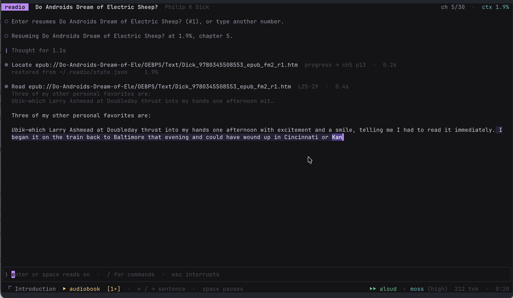
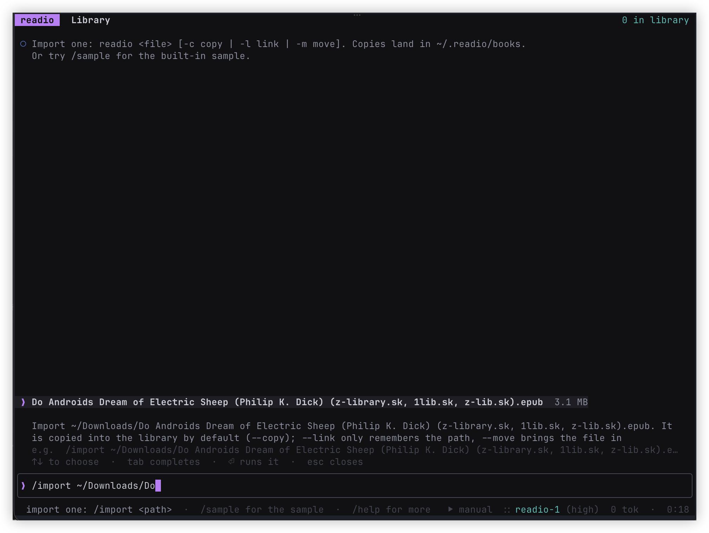
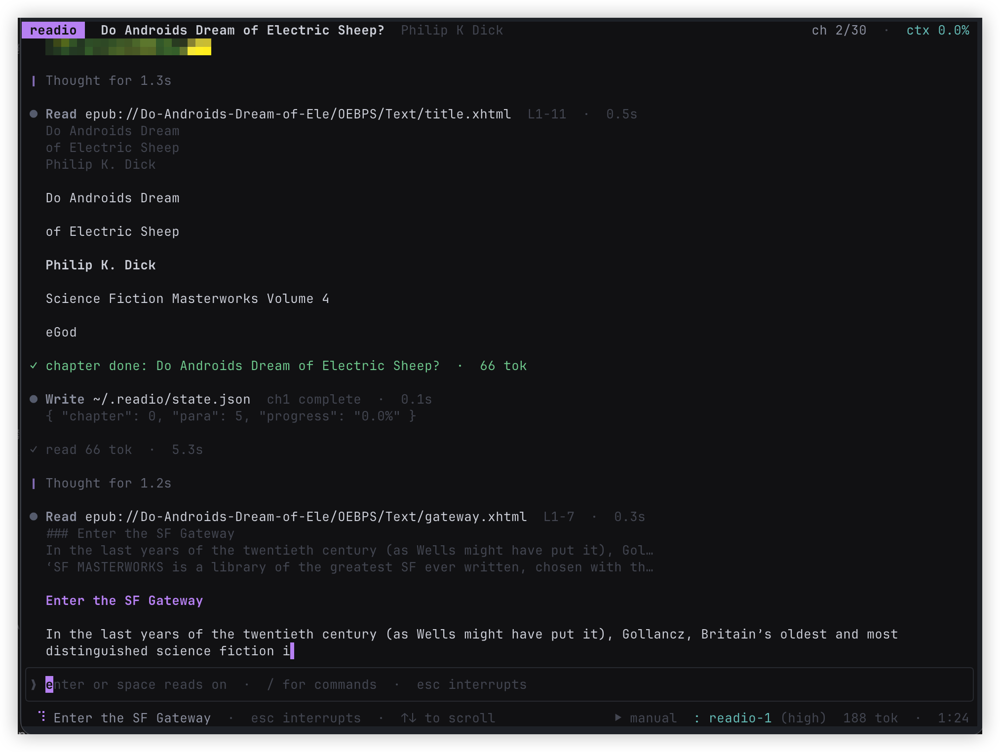

# readio

**An open-source terminal ebook reader and local TTS audiobook player disguised as an AI coding agent.** Read EPUB, PDF, Markdown and plain text without leaving the terminal: press enter and it thinks, issues a tool call, then streams the next passage of your book. It looks like coding; the book is real.

[](https://github.com/hrhrng/readio/actions/workflows/tui-ci.yml)
[](https://github.com/hrhrng/readio/releases)
[](LICENSE)
[](https://www.rust-lang.org)


[中文文档](README.zh-CN.md)

Built in Rust as a keyboard-first TUI. Chapters follow the book's own table of contents, italics stay italic, and covers and illustrations are drawn through the terminal's native image protocol. Read-aloud uses a local model of your choice, with the spoken sentence and sounded character highlighted. The core is one binary with no bundled model, assets, runtime dependencies or required cloud account.

Every number on screen is a real reading — real paragraph offsets, real line ranges, real full-text search hits. Only the vocabulary is costume.

## See it in action

Read aloud with a local MOSS model while the spoken sentence and current word stay highlighted:



Import a book, then read it in agent-shaped turns:

| Import an EPUB | Read the book |
| --- | --- |
|  |  |

<sub>Captured from real readio sessions in a terminal.</sub>

## Install

> **readio is in beta.** Releases are tagged `tui-v0.Y.0-beta.N` and flagged as prereleases on GitHub; the installer takes the newest one. Things settle as they get used — read-aloud in particular has been exercised against command templates and tests, not against every engine in the table.

```sh
curl -fsSL https://raw.githubusercontent.com/hrhrng/readio/main/apps/tui/scripts/install.sh | sh
```

The installer detects your platform, downloads the release archive, verifies it against the release's `SHA256SUMS`, and installs a single file to `~/.local/bin/readio`. It needs no sudo, no compiler and no Rust toolchain; it writes nothing outside the install directory. To uninstall, delete that file and `~/.readio`.

From source, with Rust 1.90 or newer:

```sh
cargo install --git https://github.com/hrhrng/readio readio
```

Prebuilt archives are published for `aarch64`/`x86_64` macOS and `aarch64`/`x86_64` Linux (musl, statically
linked). They are a convenience, not the only path: anything else — Windows, a BSD, an architecture nobody
packages — builds from source with the command above, since the dependency tree is pure Rust and needs no C
toolchain. Windows in particular is untested rather than unsupported.

## Building on Windows

Windows has no prebuilt archive and no installer script — it is untested rather than unsupported. The dependency tree is pure Rust, so a build needs Rust and a linker, nothing else.

1. **Install Rust** with [rustup](https://rustup.rs). Keep the default `x86_64-pc-windows-msvc` host and let it install the Visual Studio Build Tools it asks for (*Desktop development with C++*). readio contains no C, but the MSVC linker is still what `rustc` invokes. If you would rather not install Visual Studio, `rustup default stable-x86_64-pc-windows-gnu` works with MinGW-w64 instead.

2. **Build it.** In PowerShell:

   ```powershell
   git clone https://github.com/hrhrng/readio
   cd readio\apps\tui
   cargo build --release
   .\target\release\readio.exe
   ```

3. **Put it on PATH.** `cargo install --path .` places `readio.exe` in `%USERPROFILE%\.cargo\bin`, which rustup already added to your PATH.

4. **Use a VT-capable terminal.** For exact cover and illustration rendering, use a terminal that supports Kitty graphics, iTerm2 inline images or Sixel. Other terminals still run readio but show an image placeholder. In the legacy `conhost` console, run `chcp 65001` first or the box drawing and any CJK text will come out as mojibake.

5. **Where things live.** `%USERPROFILE%\.readio` holds `config.yaml`, `books\` and `state.json`. `readio --home D:\readio` moves the lot somewhere else.

6. **Read-aloud** needs no extra player: the default `play` command is a PowerShell one-liner using `Media.SoundPlayer`. You still supply the speech engine yourself and point `tts.engines.<name>.synth` at its Windows command line.

Two things do not come along. `scripts/install.sh` is POSIX sh, and `scripts/pty_probe.py` needs a POSIX pty, so neither runs here — build and run the binary directly. The audio-output whitelist also has no built-in device probe on Windows: set `tts.output.query` to a command that prints the current output device (PowerShell with the `AudioDeviceCmdlets` module, for instance), and until you do, `/device` will say it cannot read the list and that the whitelist keeps speech muted.

`cargo test` should work — the frame tests render through ratatui's `TestBackend` rather than a real terminal — but nobody has run the suite on Windows, so treat a failure there as a bug worth reporting rather than a surprise.

## Usage

```sh
readio                 # open the library
readio book.epub       # import and start reading (-c copy, the default)
readio book.pdf -l     # link: record the path, do not copy
readio book.md -m      # move: relocate the file into the library
```

Copies land in `~/.readio/books`. Use `readio --home <dir>` to keep a separate library. With no book to hand, `/sample` opens a short built-in text.

**Enter reads the next passage. Slash commands act on the book; `/find <term>` searches it.** A bare number chooses from the library or the search results currently on screen. Other text stays in the composer until it becomes a command, so a typo never turns into an accidental whole-book search.

| Key | Action |
| --- | --- |
| `enter` | keep reading or resume; mid-turn, hurry the turn while spoken text still follows the voice |
| `esc` | interrupt and hold your place; `enter` resumes |
| `space` | play/pause when the composer is empty; in Read-aloud the audio cursor is exact |
| `shift+tab` | cycle Manual → Auto → Read-aloud |
| `↑` `↓` · wheel · `pgup` `pgdn` · `home` `end` | scroll; at the bottom in Manual, load the next passage |
| `←` `→` | previous or next sentence in Read-aloud; otherwise move through the composer |
| `[` `]` | slower or faster Read-aloud playback |
| `^t` · `^o` | fold or unfold reasoning · tool calls |
| `^s` | enter Read-aloud; press again to return to the previous mode |
| `^r` | move to the next reasoning-effort level; higher effort reads more slowly |
| `^g` · `^b` | jump to the next · previous search hit |
| `^p` `^n` · `^l` | input history · clear the screen |
| `^c` · `^d` | discard a running turn / confirm quit · quit immediately |

| Command | Purpose |
| --- | --- |
| `/lib` `/open <n>` `/import <path>` `/forget <n>` `/sample` | manage the library |
| `/toc` `/plan` `/goto <n>` `/next` `/prev` | choose or move between chapters |
| `/find <term>` | search the whole book; type a number to jump to that hit |
| `/mark [note]` `/marks [n]` `/unmark <n>` | keep a place, list places, drop one |
| `/mode [manual\|auto\|aloud]` `/auto` | choose a reading mode · toggle Manual/Auto |
| `/effort [level]` `/rate <0.5-3>` `/speed <n>` | reading effort · retune its multiplier · base reveal speed |
| `/voice` (`/tts` alias) `/device` | download and configure voices · restrict audio output |
| `/context` `/progress` | session readout · one-line position |
| `/lang en\|zh` `/clear` `/help` `/quit` | interface language · clear · help · exit |

## What the interface pretends to be

| Reading concept | Shown as |
| --- | --- |
| How far through the book you are | `ctx 23.3%`, context-window usage |
| Characters in a passage | `735 tok`, a token count |
| Time since you opened the book | `0:15`, a session clock |
| Fetching the next passage | a tool call: `● Read book.epub#ch1  L1-9  ·  0.3s` |
| Full-text search | the `/find` you asked for, with real hit counts |

## Reading a book as the book is written

readio follows the file rather than the filesystem.

**Chapters come from the table of contents.** A conversion tool will happily put a dozen chapters in one XHTML file and point the ToC at anchors inside it; readio cuts there, so a book whose contents page lists 71 sections has 71 chapters and not 13. Documents the spine marks `linear="no"` — copyright pages, adverts — are not part of the read. A section the ToC never names and that carries no heading is numbered rather than named after its file, because `index_split_003` says something about the publisher's toolchain and nothing about the book.

**Italics survive.** Emphasis is kept as ranges over the text and drawn as a terminal modifier, whether the book spelled it `<em>` or — as converted EPUBs almost always do — as a CSS class with `font-style: italic`. It composes with read-aloud: an italic phrase being spoken is italic and washed at once.

**The cover is shown when you open a book**, and not when you resume one.

**Places you keep are kept properly.** `/mark` remembers where you are, `/marks` lists what you kept, `/marks <n>` goes back. Bookmarks and your reading position are stored as character offsets, so they still point at the same sentence after an update changes how the book is divided — the update that introduced ToC chapters moved every chapter number, and nobody lost their place.

## Search

`/find <term>` searches the whole book and counts **every** occurrence, not one per paragraph. The header reports what a reader wants to know before deciding whether to look: `pattern: memory · 45 matches · 30 lines · showing 12`. Matching ignores case and treats full-width punctuation and Latin letters as their ASCII equivalents, so a term typed on an English keyboard still finds text typeset in Chinese.

Type the number of a hit to jump there; `^g` and `^b` walk forward and back through the list and say so when they wrap. Arriving at a hit lights the term deeply inside its lightly washed sentence — the same two-level highlight read-aloud uses — so the eye lands on the word rather than on the paragraph.

A natural-language question may be passed explicitly to `/find`. A Chinese question rarely reads as a search term, so readio narrows it before searching: interrogative tails such as 是什么样子 or 怎么 are stripped, then progressively shorter windows of the remaining text are tried, widest first. What comes back is the longest phrase that actually occurs in the book.

## Read-aloud

readio ships no speech model, and a fresh install selects none. `/voice` opens one workspace with two deliberately separate panes: the left downloads and validates models; the right assigns a ready model, voice, language and parameters globally or to one selected book. A download never changes configuration, and saving configuration never starts a hidden download. Enter Read-aloud separately with `shift+tab`, `^s` or `/mode aloud`.

| Engine | Size · licence | Notes |
| --- | --- | --- |
| `moss` | 120M · Apache-2.0 | recommended Mandarin audiobook voice on Apple Silicon; resident |
| `kokoro` | 82M · Apache-2.0 | recommended English voice (`af_heart`); resident |
| `qwen` | 0.6B · Apache-2.0 | optional Mandarin alternative; larger and stiffer |
| `espeak` | non-neural · GPL-3.0 | multilingual, instant and robotic; one system package |
| `piper` | ~7–32M · GPL-3.0 | voice-specific Chinese or English; fast neural first sound |
| `supertonic` | 99M · MIT | multilingual, English strongest; pure ONNX, no torch |
| `openai` | remote service | any compatible `/v1/audio/speech` endpoint |

Before a model download, readio shows its estimated size and the free space it found, then asks for confirmation. It installs a pinned standalone `uv`, managed Python builds, tool environments and launchers below the platform user cache; no system Python, `uv`, `pip` or `pipx` is required. It deliberately leaves the normal uv and Hugging Face cache locations alone, so downloads already on the machine remain cache hits. Every command is written out before it runs, and shown running:

```
● Bash UV_TOOL_DIR=…/readio/runtime/tools …/readio/runtime/bin/uv
  tool install --managed-python --python 3.12 kokoro-tts  3/5  ·  24.8s
  Installed 61 packages in 3.42s
   + kokoro-tts==0.9.4

○ kokoro downloaded after 25s. Voice configuration was not changed.
```

`openai` is the exception: it is a server you run yourself, and readio says so rather than pretending it can install it. `/tts` remains an alias for opening the same Voice workspace; it is not a second switch.

A multilingual model still has to be told which language it is looking at, and its default is rarely yours: `kokoro-tts` assumes `en-us`, so Chinese handed to it unannounced is sounded out with English letter-to-sound rules. Language, engine and voice are therefore explicit global or per-book choices in the Voice form. Text never changes them sentence by sentence.

While a passage is spoken, its sentence is washed lightly and the word or character being sounded is washed deeply, and the reveal speed follows each clip's real duration rather than a guess.

Speed works the way an audiobook app's does. In Read-aloud, `[` and `]` step through 0.75×, 1×, 1.25×, 1.5× and 2×; `/rate` accepts any value from 0.5 to 3 for the current effort level, while `^r` cycles the named effort levels used by both text and voice. The embedded player changes tempo through libsonic while preserving pitch. Canonical 1× clips, the current audio pointer, the synthesis cache and everything already prefetched remain valid across a speed change.

Space pauses at the live PCM frame and resumes from the same audio millisecond. `←` and `→` move to the previous or next textual sentence without leaving Read-aloud. Token reveal and both highlight levels sample the same presentation clock as the audio, so pausing, seeking and changing speed cannot make text run on by itself.

Sentences are rendered ahead of playback on a thread of their own. `voice.prefetch`, eight by default, is a hard sentence cap; inside it a playback-aware controller targets roughly 24 seconds of runway and renders farther ahead at faster live speeds. The boundary between two paragraphs is covered as well: readio asks the turn where it is going and warms the next paragraph's opening sentence underneath the current one.

Engines that support it are kept running rather than started per sentence, which is most of what makes a local model usable: Kokoro took 8.4 seconds for a short sentence through its command line and takes 0.5–0.8 as a resident process with its phonemizer cached. If you would rather have sound instantly than have it beautiful, `espeak` says the same sentence in 0.03 and installs from one `brew` or `apt` package.

And read-aloud does not degrade. If the voice breaks — engine gone, device not allowed, synthesis failed — reading stops where the voice stopped and says why, rather than carrying on scrolling to a reader whose eyes are elsewhere. `⏎` retries.

`/device` restricts playback to named audio outputs. When headphones disconnect and the system quietly falls back to the speakers, readio mutes, names the device it found, and offers the way out on screen. An output it cannot identify counts as not allowed.

## Configuration

One file, `~/.readio/config.yaml`, written with comments on first run. readio reads no environment variables. The interface is English by default; set `language: zh` for Chinese. Commands such as `/mode`, `/effort`, `/speed`, `/voice`, `/rate`, `/lang` and `/device` write their changes back to the same file.

## Development

```sh
cd apps/tui
cargo test                                     # full Rust suite
python3 scripts/pty_probe.py 96 24 "wait:0.6,type:/sample,key:enter,wait:2"
```

The probe drives the binary in a real pty and prints the screen it produced, including a map of which cells were highlighted — the failures that matter here are raw mode, the alternate screen and whether the terminal is restored on exit, none of which a unit test can see. CI runs the suite on macOS and Linux and the probe on both.

## Repository layout

`apps/tui` holds this reader; [`apps/tui/README.md`](apps/tui/README.md) is its implementation guide — module map, the invariants each layer holds, and how the thing is tested and shipped.

`apps/web`, `apps/api` and `apps/extension` are the Speechify-like web stack this repository started as; their setup lives in [`docs/web-api-extension.md`](docs/web-api-extension.md).

## Licence

MIT, for everything in this repository. See [`LICENSE`](LICENSE).
